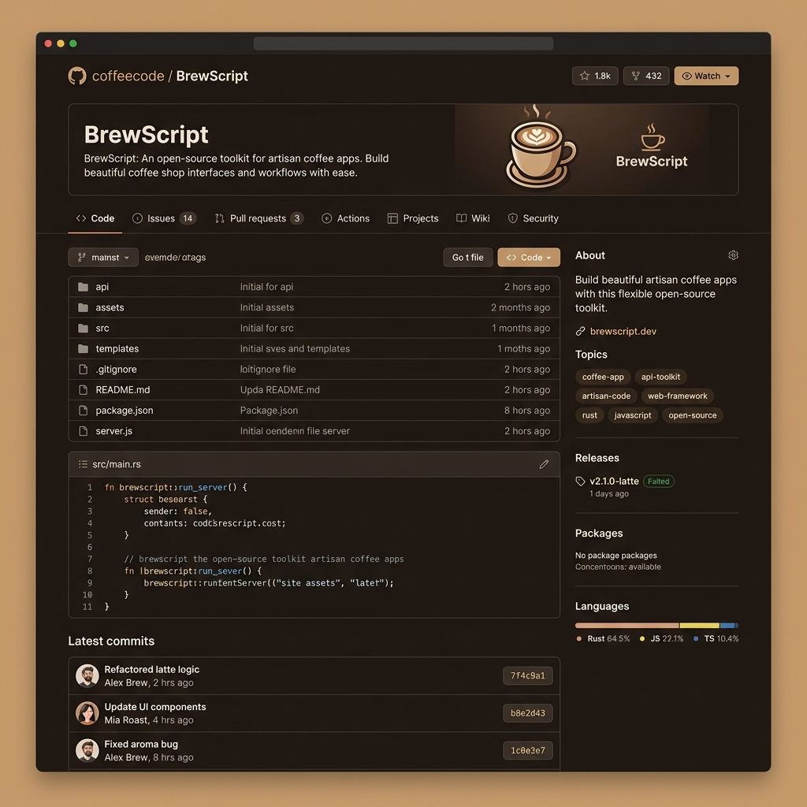
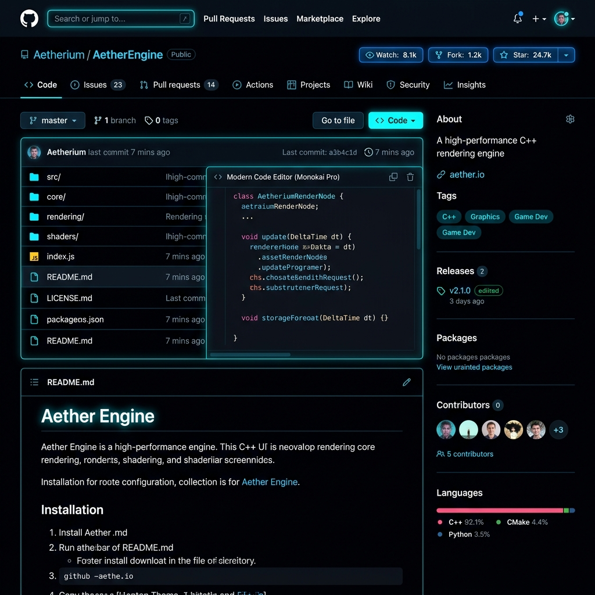
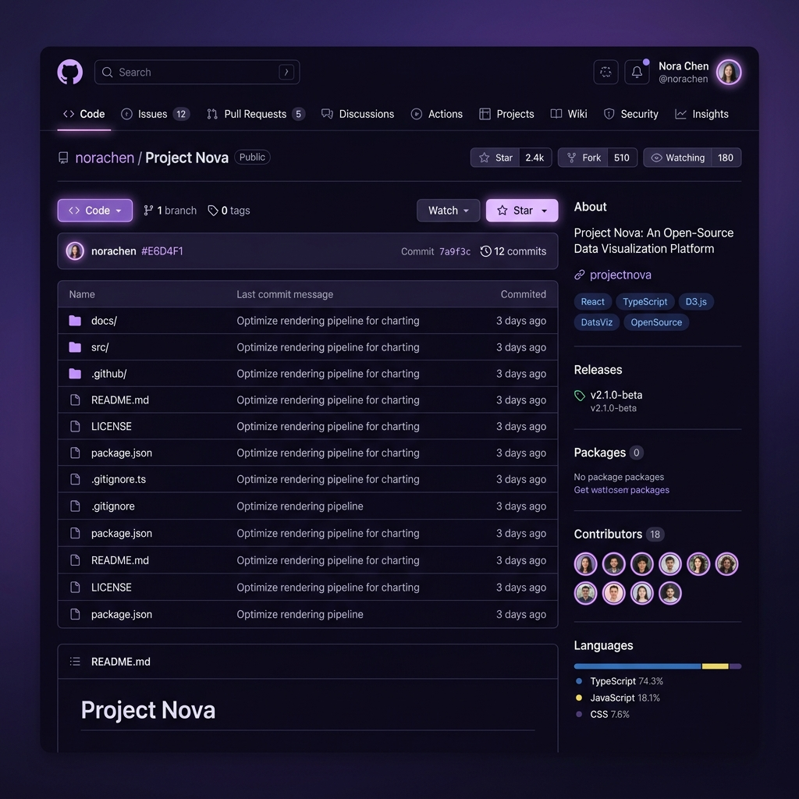

# GitHub Customizer & Fidget Mod

An all-in-one productivity and customization mod for GitHub. It replaces standard styling with premium dark color modes, injects custom helper scripts, and features an interactive contribution-board fidget Pop It directly inside your browser toolbar!

---

## 🚀 Key Features & Mods

This extension is a comprehensive mod utility containing several visual and functional enhancements:

### 1. 🎨 Premium Color Themes
Override standard styles globally with four curated, high-end themes:
*   **☕ Coffee Shop**: Cozy espresso dark backgrounds (#1e1612) with creamy latte text and warm caramel highlights.
*   **🖤 AMOLED Black**: Pure pitch-black theme (#000000) optimized for OLED displays, featuring electric neon-cyan borders.
*   **💜 Midnight Purple**: A dreamy night-violet background with soft lilac accents and glowing borders.
*   **🌊 Calm Dark**: Desaturated Nordic slate blue-gray layout designed for low eye strain.

### 2. 🧘 Focus Mode (Zen Mod)
Toggle on Focus Mode to remove clutter! It hides GitHub's global header navigation, sidebars, and footer panels on repository and file browser pages, centering the code or Markdown rendering area for full immersion.

### 3. 📈 Interactive Contributions Calendar
Injects smooth pop-out animations on user profile calendars. Contribution squares scale up, glow, and brighten fluidly when hovered.

### 4. 🔝 Floating Back-to-Top Button
Adds a floating navigation aid in the bottom-right corner when scrolling down long repository readmes, issues, or pull request conversations. Click to scroll smoothly back to the top of the page.

### 5. 🕹️ Fidget Pop It (Pop It Board)
An interactive contribution-graph sensory board inside the toolbar popup. Pop the squares to cycle color levels and synthesize satisfying bubble pop click sound effects in real time using the **Web Audio API** (complete with randomized pitch sweeps for organic sound). The board state is stored in your local browser storage.

### 🗂️ Live Developer Info Card
The extension dynamically fetches real profile statistics (avatar, name, bio, follower count, and repository stars) for developer **[@tomokuroki](https://github.com/tomokuroki)** using the GitHub REST API.

---

## 📸 Theme Screenshots

Here are previews of the premium color modifications applied to GitHub pages:

### ☕ Coffee Shop Theme

### 🖤 AMOLED Black Theme

### 💜 Midnight Purple Theme

---

## 🛠️ How to Install (Developer Mode)

### Chrome / Edge / Brave / Opera
1.  Open your browser and navigate to the Extensions management page:
    *   **Chrome**: `chrome://extensions/`
    *   **Edge**: `edge://extensions/`
2.  Enable **Developer mode** in the top-right corner.
3.  Click the **Load unpacked** button in the top-left corner.
4.  Select the extension workspace folder containing `manifest.json`.
5.  Pin the extension to your browser toolbar for quick access!

### Firefox
1.  Open Firefox and navigate to `about:debugging`.
2.  Click **This Firefox** in the sidebar.
3.  Click **Load Temporary Add-on...**.
4.  Select the `manifest.json` file inside the workspace folder.

---

## 👨‍💻 Developer & Author
Developed with ❤️ by **[@tomokuroki](https://github.com/tomokuroki)**. Follow for more projects, open pull requests, or submit feedback!
